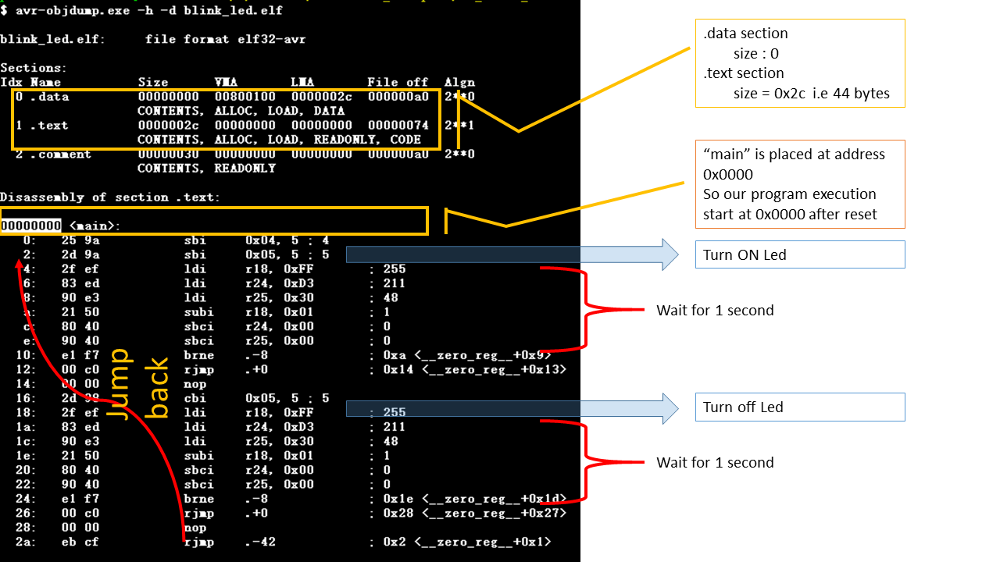

# Blink LED Program using Baremetal C Programming

## Introduction
Baremetal programming involves writing software that runs directly on the hardware without the overhead of an operating system. This approach is crucial for embedded systems, as it gives developers full control over hardware, enabling efficient use of resources and precise timing control. In this tutorial, we will explore a simple LED blink program written in pure C for an AVR microcontroller, demonstrating the basics of baremetal programming.

## Why Baremetal Programming?
1. **Efficiency**: Direct hardware access reduces latency and overhead.
2. **Control**: Fine-grained control over hardware resources and peripherals.
3. **Understanding**: Helps in understanding low-level hardware functionality.
4. **Portability**: Provides insights into writing hardware-agnostic code.

## Code Overview
This is a simple program to blink an LED connected to an AVR microcontroller. It uses two header files provided by AVR:

- `#include <avr/io.h>`: Provides definitions for the microcontroller’s registers and bit manipulation macros.
- `#include <util/delay.h>`: Offers a convenient delay function for timing.

However, in subsequent tutorials, we aim to remove these dependencies(`avr/io.h` and `util/delay.h`) to better understand the underlying hardware and create fully self-contained code.

### Code
```c
#include <avr/io.h>
#include <util/delay.h>

#define LED_PIN PB0

int main(void) {
    // Set LED_PIN as output
    DDRB |= (1 << LED_PIN);

    while (1) {
        // Turn LED on
        PORTB |= (1 << LED_PIN);
        _delay_ms(1000);

        // Turn LED off
        PORTB &= ~(1 << LED_PIN);
        _delay_ms(1000);
    }

    return 0; // This line will never be reached
}
```

### Explanation
1. **Setting the Direction Register**: The `DDRB` register controls the direction of the pins in port B. Setting `PB0` as output is done using the line:
   ```c
   DDRB |= (1 << LED_PIN);
   ```
   This sets the corresponding bit in `DDRB` to `1`.

2. **Turning the LED On and Off**:
   - Turning the LED on involves setting the `PB0` bit in the `PORTB` register:
     ```c
     PORTB |= (1 << LED_PIN);
     ```
   - Turning the LED off involves clearing the `PB0` bit:
     ```c
     PORTB &= ~(1 << LED_PIN);
     ```

3. **Delays**: The `_delay_ms(1000)` function provides a delay of 1000 milliseconds (1 second) between turning the LED on and off. This creates the blink effect.

4. **Infinite Loop**: The `while (1)` loop ensures that the LED continues to blink indefinitely.

## Compilation and Flashing
To compile and flash the code onto the microcontroller, use the provided `Makefile`. The steps are as follows:

### Makefile
```make
all:
	avr-gcc -Os -DF_CPU=16000000UL -mmcu=atmega328p -nostdlib -o blink_led.elf blink_led.c 
	avr-objcopy -O binary blink_led.elf blink_led.bin

deploy:
	avrdude -F -V -c arduino -p atmega328p -P COM8 -b 115200 -U flash:w:blink_led.bin

clean:
	rm -rf *.o *.elf *.bin
```

### Explanation
1. **Compilation**:
   - `avr-gcc`: The compiler used to generate the object file. Options used:
     - `-Os`: Optimize for size.
     - `-DF_CPU=16000000UL`: Define the CPU clock frequency (16 MHz).
     - `-mmcu=atmega328p`: Specify the target microcontroller.
     - `-nostdlib`: Exclude standard libraries for minimal code.
   - `avr-objcopy`: Converts the compiled ELF file to a binary file.

2. **Flashing**:
   - `avrdude`: Used to upload the binary file to the microcontroller.
     - `-F`: Disable signature check.
     - `-V`: Disable verification after upload.
     - `-c arduino`: Specify the programmer type.
     - `-p atmega328p`: Target microcontroller.
     - `-P COM8`: Specify the COM port.
     - `-b 115200`: Set the baud rate.
     - `-U flash:w:blink_led.bin`: Write the binary file to the flash memory.

3. **Cleaning**:
   - The `clean` target removes intermediate and output files.

### Commands
Run the following commands in sequence:
1. Compile the code:
   ```bash
   make all
   ```
2. Flash the binary to the microcontroller:
   ```bash
   make deploy
   ```
3. Clean up intermediate files:
   ```bash
   make clean
   ```
   
### Additonal Tips
Use avr-objdump.exe to dump section header and disassembly:
```
 $ avr-objdump.exe -h -d blink_led.elf
```


## Conclusion
This simple LED blink example lays the foundation for baremetal programming. Understanding how to control hardware at the register level is a key skill for embedded systems developers. Stay tuned for the next tutorial, where we will take a deeper dive into custom implementations and remove external dependencies.

