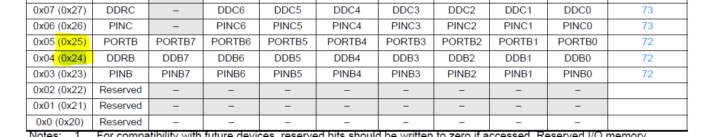

# Register-Level Read/Write Example

## Introduction
This tutorial is a continuation of the Blink LED example, where we introduced basic baremetal programming. In this example, we remove the dependency on `#include <avr/io.h>` and directly manipulate registers to control the hardware. This approach deepens our understanding of microcontroller architecture and register-level programming.

## Goals
1. **Dependency Removal**: Eliminate the use of `#include <avr/io.h>`.
2. **Learn Register Access**: Understand how to read and write to registers directly using memory addresses.
3. **Custom Reset Handler**: Since functions like `set_bit` and `clear_bit` are defined before `main`, the program start address is not at `0x0000`. We create a reset handler to jump to `main()`.

## Code
```c
//#include <avr/io.h>
#include <util/delay.h>

#define DDRB_ADDR        (0x24)
#define PORTB_ADDR       (0x25)

__attribute__((naked)) void reset_handler() {
    asm volatile ("rjmp main");
}

void set_bit(uint16_t addr, uint8_t bit) {
    uint8_t *reg = (uint8_t *)addr; // Create a pointer to the address
    *reg |= (1 << bit);            // Set the specified bit
}

void clear_bit(uint16_t addr, uint8_t bit) {
    uint8_t *reg = (uint8_t *)addr; // Create a pointer to the address
    *reg &= ~(1 << bit);           // Clear the specified bit
}


int main() {
    // Set PORTB5 as output
    set_bit(DDRB_ADDR, 5);

    while(1) {
        // Set PORTB5
        set_bit(PORTB_ADDR, 5);

        // Wait
        _delay_ms(1000);

        // Clear PORTB5
        clear_bit(PORTB_ADDR, 5);

        // Wait some more
        _delay_ms(1000);
    }
}
```

## Makefile
```make
all:
	avr-gcc -Os -DF_CPU=16000000UL -mmcu=atmega328p -nostdlib -o reg_readwrite.elf reg_readwrite.c 
	avr-objcopy -O binary reg_readwrite.elf reg_readwrite.bin

deploy:
	avrdude -F -V -c arduino -p atmega328p -P COM8 -b 115200 -U flash:w:reg_readwrite.bin

clean:
	rm -rf *.o *.elf *.bin
```

## Explanation
### 1. Register Addresses
- **DDRB_ADDR (0x24)**: The Data Direction Register for Port B (DDRB) controls whether each pin in Port B is configured as input or output.
- **PORTB_ADDR (0x25)**: The Port B Data Register (PORTB) is used to set the output value (HIGH or LOW) for each pin in Port B.

These addresses are derived from the ATmega328P datasheet. They correspond to the memory-mapped I/O locations for the respective registers.



### Register Access Functions
- `set_bit`: Sets a specific bit in a register.
- `clear_bit`: Clears a specific bit in a register.

### Disassembly
```asm
Disassembly of section .text:

00000000 <reset_handler>:
   0:   17 c0           rjmp    .+46            ; 0x30 <main>

00000002 <set_bit>:
   2:   fc 01           movw    r30, r24
   4:   21 e0           ldi     r18, 0x01       ; 1
   6:   30 e0           ldi     r19, 0x00       ; 0
   8:   01 c0           rjmp    .+2             ; 0xc <set_bit+0xa>
   a:   22 0f           add     r18, r18
   c:   6a 95           dec     r22
   e:   ea f7           brpl    .-6             ; 0xa <set_bit+0x8>
  10:   90 81           ld      r25, Z
  12:   92 2b           or      r25, r18
  14:   90 83           st      Z, r25
  16:   08 95           ret

00000018 <clear_bit>:
  18:   fc 01           movw    r30, r24
  1a:   21 e0           ldi     r18, 0x01       ; 1
  1c:   30 e0           ldi     r19, 0x00       ; 0
  1e:   01 c0           rjmp    .+2             ; 0x22 <clear_bit+0xa>
  20:   22 0f           add     r18, r18
  22:   6a 95           dec     r22
  24:   ea f7           brpl    .-6             ; 0x20 <clear_bit+0x8>
  26:   20 95           com     r18
  28:   90 81           ld      r25, Z
  2a:   29 23           and     r18, r25
  2c:   20 83           st      Z, r18
  2e:   08 95           ret

00000030 <main>:
  30:   25 9a           sbi     0x04, 5 ; 4
  32:   2d 9a           sbi     0x05, 5 ; 5
  34:   2f ef           ldi     r18, 0xFF       ; 255
  36:   83 ed           ldi     r24, 0xD3       ; 211
  38:   90 e3           ldi     r25, 0x30       ; 48
  3a:   21 50           subi    r18, 0x01       ; 1
  3c:   80 40           sbci    r24, 0x00       ; 0
  3e:   90 40           sbci    r25, 0x00       ; 0
  40:   e1 f7           brne    .-8             ; 0x3a <main+0xa>
  42:   00 c0           rjmp    .+0             ; 0x44 <__SREG__+0x5>
  44:   00 00           nop
  46:   2d 98           cbi     0x05, 5 ; 5
  48:   2f ef           ldi     r18, 0xFF       ; 255
  4a:   83 ed           ldi     r24, 0xD3       ; 211
  4c:   90 e3           ldi     r25, 0x30       ; 48
  4e:   21 50           subi    r18, 0x01       ; 1
  50:   80 40           sbci    r24, 0x00       ; 0
  52:   90 40           sbci    r25, 0x00       ; 0
  54:   e1 f7           brne    .-8             ; 0x4e <__SREG__+0xf>
  56:   00 c0           rjmp    .+0             ; 0x58 <__SREG__+0x19>
  58:   00 00           nop
  5a:   eb cf           rjmp    .-42            ; 0x32 <main+0x2>

```

These functions make the code modular and reusable.

### Custom Reset Handler
Since the `set_bit` and `clear_bit` functions are placed before `main`, the program does not start at the default address `0x0000`. To address this, we define a custom reset handler that jumps to `main()` using the `rjmp` assembly instruction.

### Program Flow
- The `set_bit` function configures `PORTB5` as an output pin by writing to the `DDRB` register.
- Inside the infinite loop:
  - `PORTB5` is set HIGH to turn on the LED.
  - A delay of 1 second is introduced using `_delay_ms`.
  - `PORTB5` is cleared to turn off the LED.
  - Another delay of 1 second is introduced.

## Register Details
### DDRB (Data Direction Register B)
- **Purpose**: Configures the direction of each pin in Port B as input or output.
- **Address**: `0x24`

### PORTB (Port B Data Register)
- **Purpose**: Sets the output value (HIGH or LOW) for each pin in Port B.
- **Address**: `0x25`

### Why Use 0x24 and 0x25?
These addresses are specific to the ATmega328P microcontroller and are defined in its datasheet. They represent the memory-mapped locations for the DDRB and PORTB registers, respectively. Direct manipulation of these addresses allows for fine-grained control of the hardware.

## Summary
This example builds upon the Blink LED program by introducing direct register access and a custom reset handler. This step is crucial for understanding how microcontrollers operate at a low level, preparing us for more advanced baremetal programming techniques.

In the next tutorial, we will explore additional peripherals and further remove dependencies to deepen our understanding of embedded systems.

